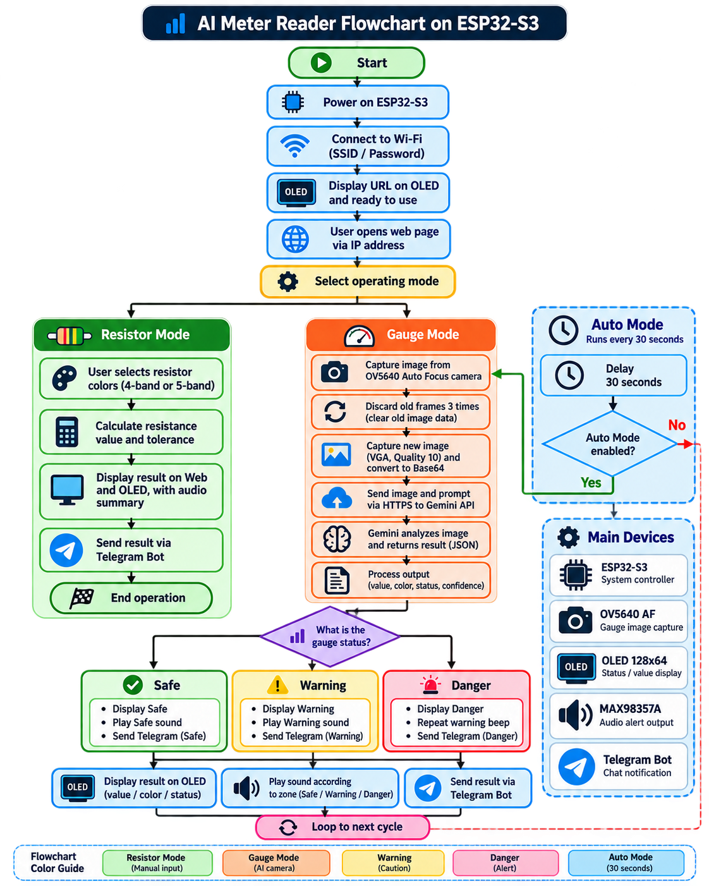

# 📷 AI-Based Industrial Gauge & Resistor Monitoring System

Embedded monitoring system using **ESP32-S3**, **OV5640**, **Gemini AI**, **Telegram**, **OLED**, and **audio alerts** for resistor calculation and industrial gauge monitoring.

<p align="center">
  
  
  
  
</p>

<p align="center">
  
  
  
  
</p>

---

## 🚀 Project Overview

This project was developed as a second-year Mechatronics Engineering project.

The system combines **embedded hardware, camera sensing, cloud AI, web control, Telegram notification, and audio feedback** into one monitoring device.

It operates in two main modes:

```text
Resistor Mode
      ↓
Select 4-band / 5-band colors
      ↓
ESP32-S3 local calculation
      ↓
Web + OLED result

Gauge Mode
      ↓
OV5640 captures gauge image
      ↓
Gemini AI analysis
      ↓
SAFE / WARNING / DANGER
      ↓
OLED + Telegram + Audio Alert
```

---

## 🔄 System Flowchart

<p align="center">
  
</p>

<p align="center">
  <b>Overall workflow of Resistor Mode, Gauge Mode, Gemini analysis, and alert output.</b>
</p>

---

## 🧪 Testing Results

The gauge monitoring system was tested at three operating conditions.

| Gauge Value | Zone | Result |
|---:|---|---|
| 230 bar | Green | SAFE |
| 300 bar | Yellow / Boundary | WARNING |
| 500 bar | Red | DANGER |

The system displays the result on the OLED and sends the corresponding status through Telegram.

👉 **[View Hardware & Test Images](./assets/)**

---

## ✨ Key Features

- 4-band and 5-band resistor calculation
- Local resistor calculation on ESP32-S3
- OV5640 Auto Focus camera integration
- Industrial gauge image analysis using Gemini AI
- Safe / Warning / Danger classification
- Web-based system control
- OLED status display
- Telegram notifications
- I2S audio feedback
- Automatic gauge monitoring every 30 seconds

---

## 🧩 Hardware Used

| Component | Purpose |
|---|---|
| ESP32-S3 CAM | Main controller |
| OV5640 Auto Focus Camera | Captures gauge images |
| OLED 128×64 | Displays values and system status |
| MAX98357A | I2S audio amplifier |
| 3W Speaker | Audio feedback and warning |
| Wi-Fi | Gemini API and Telegram communication |

👉 **[View Wiring Diagram](./assets/wiringdiagram.jpg)**

---

## 🛠️ Tech Stack

| Layer | Technology |
|---|---|
| Microcontroller | ESP32-S3 |
| Programming | C / C++ |
| Camera | OV5640 Auto Focus |
| AI | Gemini Cloud AI |
| Communication | Wi-Fi, HTTPS, JSON |
| User Interface | ESP32 Web Server |
| Notification | Telegram Bot API |
| Display | SSD1306 OLED |
| Audio | I2S + MAX98357A |

---

## 🧠 Gauge Monitoring Logic

The captured gauge image is converted and sent to Gemini AI for analysis.

Gemini returns:

```text
VALUE
COLOR
STATUS
CONFIDENCE
DETAIL
```

The system then maps the result into three operating conditions:

```text
GREEN  → SAFE
YELLOW → WARNING
RED    → DANGER
```

Danger status also activates a repeating audio warning.

---

## 🔧 Engineering Challenges & Solutions

### Camera Preview Latency

Continuous image streaming caused high processing load.

**Solution:** Capture images only when Preview or Analyze is requested.

### Image Quality

Low image quality reduced gauge-reading accuracy.

**Solution:** Adjusted the camera to VGA resolution and improved JPEG quality.

### Old Camera Frames

Automatic monitoring occasionally reused old frames.

**Solution:** Discard three old frames before capturing a new image.

### Power Stability

The ESP32-S3 occasionally restarted with an unstable external power source.

**Solution:** Changed to a more stable USB-C power source.

### Audio Delay

Generating audio online introduced unnecessary delay.

**Solution:** Stored WAV audio locally and played it through I2S.

---

## 🎥 Demo Video

▶️ **[Watch Project Demo](https://www.youtube.com/watch?v=fDfO5gYfs7E)**

---

## 📁 Project Structure

```text
ai-industrial-gauge-resistor-monitoring/
├── README.md
├── original-project.ino
├── project-report.pdf
└── assets/
    ├── system-flowchart.png
    ├── wiringdiagram.jpg
    ├── Resistor Mode.jpg
    ├── Safe Mode.jpg
    ├── Safe Telegram.jpg
    ├── Warning Mode.jpg
    ├── Warning Telegram.jpg
    ├── Danger Mode.jpg
    └── Danger Telegram.jpg
```

---

## 💻 Source Code

👉 **[View Source Code](./original-project.ino)**

---

## 📄 Project Report

👉 **[View Full Project Report](./project-report.pdf)**

---

## 🔬 Personal Extension — TinyML

After completing the original working project, I continued exploring an **on-device TinyML approach using Edge Impulse**.

This extension is separate from the original project and focuses on experimenting with local image classification directly on the ESP32-S3.

---

## 👤 Author

**Pakinthon Chalermchai**  
Mechatronics Engineering Student, KMUTT
